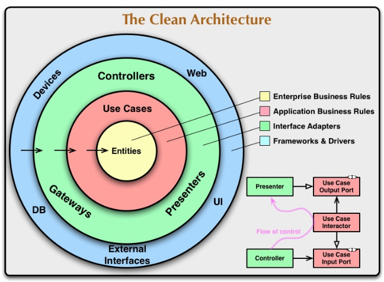

## Authentication and JWT (13th Session)
\* The data in the Header and payload part of the JWT can be achieved without using the secret key in the signiture part. So we must avoid putting secret data in payload and header part of the JWT.

\* For JSON data format, the best practice for fields is snake_case.

\* It is better not to update refresh token with refresh token request. Because if we do this, the user by having refresh token, can always logging in without any problem.

\* It is better for authentication, to considered as a service and the app has the authentication as a service, not pkg or utils.

\* You should consider a field or something different in access and refresh token for seperating between them.

\* If you have two services and in one of them you want to use methods of another service, it is better to declare interface in the first service and add the methods which you need in this interface and use this interface as a dependency not importing the whole service. And also pay attention that it is better to declare the interface in the first service not the second service which the implementations and methods are there. It is better for seperation of concerns. Because we know and find that in the first service we need which methods from the other services.

\* In designing the application, we usually don't worried about the dependency of outer layers like controllers to more inner parts like entities or services and business logic of the app. Because if the app designed well there must not be dependency in inner parts to the controllers and we just get the inputs from them and in the end send the output to them. Inner and outer part of the application =>

### Routers and middlewares
The good thing about some external router packages instead of default router of go, is that they support different regex and complex regex formats for the requests, have some default middlewars, they define the method of the request (POST, GET and etc) and other benefits. So we prefer to use these middlewares instead of default mux middleware of Go.

\* There are also some handler frameworks that give us more functionalities and easier working with marshalling and unmarshalling requests and responses, adding status codes to the responses and some other things that make work for us easier. Like gin, echo, beego and etc.

\* CORS origin middleware is a middleware in which we say that which IP addresses are ligal for requesting to our website.

